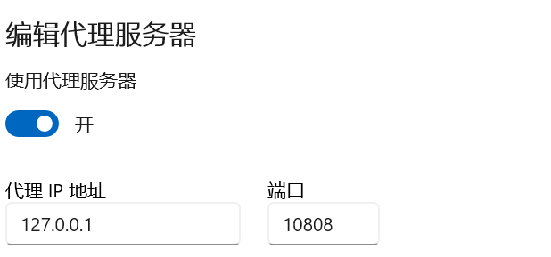

*如果你的vpn没有问题，能够访问github 但是使用git时无法拉取或者无法上传的话，我们可以先检查git 的代理*

```
$ git config --global http.proxy 
$ git config --global https.proxy 
```

*有数据的话先将代理清除*

```
$ git config --global --unset http.proxy
$ git config --global --unset https.proxy
```

解决步骤
1. 打开vpn 这里的本地冒号后面的就是端口号 
   
   
2. 在设置搜索代理，点击下面的编辑也能看见
   
   
3. 根据本地中的端口号来设置git的代理
   
   ```
   $ git config --global http.proxy '127.0.0.1:10808'
   $ git config --global https.proxy '127.0.0.1:10808'
   ```

4. 设置完成后再次尝试提交就能成功